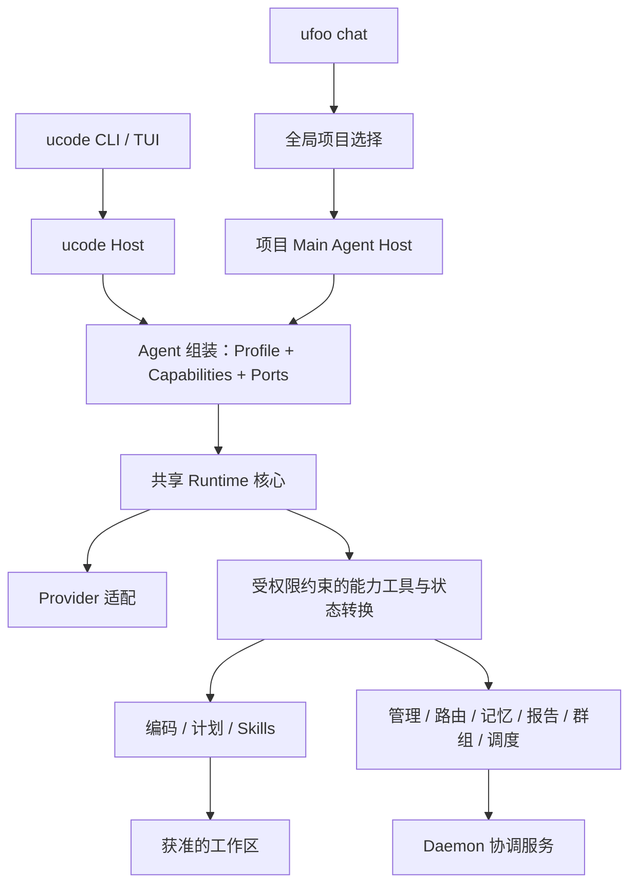

# 分层可插拔 Agent Runtime 改造方案

日期：2026-10-08  
状态：P0–P5 已落地，默认新会话使用共享 main runtime；实际 API、兼容窗口与恢复边界见第 11 节。  
范围：提取 ucode 的执行能力供 ufoo 共用，使 ufoo 主 agent 能编码、路由、管理 agent，并处理协调任务。

## 1. 目标与边界

将当前分散在 ucode 与 ufoo controller 中的公共执行能力整理为分层、可组合的 agent runtime。

最终产品关系：

- `ucode`：使用共享 runtime 的独立 coding agent，保留 CLI/TUI 入口。
- 项目级 `ufoo-agent`：使用共享 runtime 的主 agent，具备编码、委派、任务跟踪与结果验收能力。
- 全局入口：选择项目或回答全局问题，再进入目标项目的主 agent。
- daemon：继续拥有项目运行时、进程生命周期、消息投递、调度和协调状态。
- Codex、Claude 等外部 agent：继续通过既有 wrapper/native channel/MCP 接入。

用户可以直接交付一个任务。主 agent 读取必要上下文后，决定自行实现、延续已有 worker 的任务、启动新 worker，或组织多个任务，最后向用户交付经过检查的结果。

本轮方案优先采用仓库内模块。独立 npm 包、第三方插件发现、热加载、远程插件执行不属于第一轮范围。模块具备稳定接口后，再判断是否值得拆包。

## 2. 当前实现与改造依据

本节记录实施前的源码基线；实施后的目录边界见 [PROJECT.md](PROJECT.md)，进展见第 11 节。

| 当前位置 | 现有职责 | 改造方向 |
|---|---|---|
| [src/code/nativeRunner.js](src/code/nativeRunner.js) | Provider 调用、流式输出、工具循环、预算、取消、计划/任务控制、用户交互 | 拆出通用循环与协议；编码和计划策略由能力模块提供 |
| [src/code/agent.js](src/code/agent.js) | 上下文组装、skills、会话提交、自然语言任务入口、交互恢复 | 拆出通用会话协调，保留 ucode 入口适配 |
| [src/code/context/](src/code/context/) | 上下文、工作集、执行状态、计划图、交互与制品 | 通用上下文机制共享；编码/计划投影归对应能力 |
| [src/code/conversation/sessionJournal.js](src/code/conversation/sessionJournal.js) | 会话事件日志 | 提供共享 journal 接口；保持已有数据可读 |
| [src/code/sessionStore.js](src/code/sessionStore.js) | 会话元数据与投影检查点 | 注入存储 namespace 与 codec，避免固定 ucode 身份 |
| [src/code/protocol/](src/code/protocol/) | 工具调用账本、协议校验、暂停恢复、状态转换 | 分离通用协议和业务状态转换；逐项验证成熟度 |
| [src/code/runtime/](src/code/runtime/) | TaskRun、mailbox、任务推进、唤醒、写 lease | 提取通用任务机制；计划图执行保留为可选能力 |
| [src/agents/controller/ufooAgent.js](src/agents/controller/ufooAgent.js) | 路由上下文、提示、模型调用、JSON 路由输出、简化历史 | 使用共享 runtime，并保留迁移期路由输出适配 |
| [src/agents/controller/loopRuntime.js](src/agents/controller/loopRuntime.js) | Controller 多轮执行、预算、工具结果反馈、观测 | 通用机制进入 runtime；协调策略进入能力模块 |
| [src/agents/controller/controllerToolExecutor.js](src/agents/controller/controllerToolExecutor.js) | Controller 工具调用及 daemon 操作接入 | 工具执行通过统一注册表与受限 host ports 接入 |
| [src/agents/providers/](src/agents/providers/) 与 [src/code/providers/](src/code/providers/) | 上游认证、请求、模型协议、传输适配 | 保留 provider 身份差异，提取可共用的传输协议 |
| [src/tools/](src/tools/) 与 [src/code/tools/](src/code/tools/) | 协调工具与编码工具 | 统一运行时描述协议；业务 handler 保留明确归属 |
| [src/runtime/daemon/promptRequest.js](src/runtime/daemon/promptRequest.js) | 全局/项目入口、gate router、controller 执行选择 | 接入项目主 agent host，保留明确指定和快速路由 |

需要明确的现状：

1. `nativeRunner` 固定了核心工具名，并直接处理 `plan_graph`、`task_run` 等业务规则。单纯移动文件无法获得可插拔 runtime。
2. `upstreamTransport` 已依赖 `code/nativeRunner` 的配置与 URL helper。提取共享层应消除这类由 provider 指向产品 runner 的依赖。
3. 注册表中的 [route_agent](src/tools/tier1/routeAgent.js) 使用 dormant handler。现有有效路由主要在 controller/orchestration 流程中，不能假设注册工具已经实现完整路由。
4. ucode 会话路径包含 `.ufoo/agent/ucode/`，主 agent 需要独立 namespace，不能共享同一份可变会话。
5. [workspaceLease](src/code/runtime/workspaceLease.js) 的状态位于单个 `executionState` 中，不能充当跨 agent、跨进程的项目写入协调。
6. 工具账本仍包含 shadow 阶段实现。抽取不代表直接扩大其保证范围，协议接管需单独通过故障恢复验证。

## 3. 分层架构



### 3.1 Runtime 核心

核心负责：模型轮次、工具调用协议、结果反馈、预算、取消、暂停恢复、通用事件、会话提交和任务执行接口。

核心不固定编码工具名、路由 JSON schema、计划图结构或 agent 类型。任何业务能力都通过工具描述、策略与受限扩展接口接入。

核心不得导入 CLI、TUI、daemon 实现或具体能力模块。外层组装依赖，核心调用注入的接口。

### 3.2 Provider 适配

适配器将统一模型消息与工具定义转换为 provider 协议，并将输出归一化为文本、思考、工具调用、用量及错误事件。

- 认证读取与必要刷新仍归 provider credential adapter。
- Router 模型配置和 coding 模型配置可以不同，共用执行机制不要求同一个模型。
- 不将 MCP capability handle 当作模型 provider 的认证凭据。
- 不因 runtime 抽取写入用户全局 Codex/Claude 配置或替换其认证 header。
- 工具调用、图像、暂停恢复等支持情况通过显式特性声明校验。缺少必需特性时返回明确错误。
- 外部 Codex/Claude agent 继续使用既有宿主协议；共享 runtime 不接管其内部模型循环。

### 3.3 能力模块

能力模块可提供工具、提示说明、上下文来源、状态转换和事件订阅。各项扩展均可选，接口固定，不允许模块任意改写整个执行循环。

| 能力 | 内容 | 初始归属 |
|---|---|---|
| `coding` | 文件读取、图片读取、编辑、写入、shell、制品读取 | 封装 `src/code/tools/` |
| `planning` | 计划图、任务展开、检查点、计划执行策略 | 提取当前计划/任务业务逻辑 |
| `skills` | Skills 发现、选择、提示注入 | 封装当前 skills 实现 |
| `agent-management` | Agent 查询、启动、关闭、改名、角色配置 | Shared tools + daemon ports |
| `agent-routing` | 候选上下文、归属判断、委派计划、结果校验 | Controller + orchestration 路由逻辑 |
| `project-discovery` | 项目注册表、项目选择、有限项目摘要 | Registry + project gateway |
| `shared-memory` | Decisions、memory、history 检索与获准更新 | Coordination + shared tools |
| `task-reports` | 任务关联、进展、终态报告、验收及主会话唤醒 | Report store + daemon bridge |
| `groups` | 模板、角色、组任务和依赖推进 | Group orchestration |
| `scheduling` | 定时任务创建、查询、停止 | Daemon cron 服务 |

工具、提示描述和 MCP 定义从同一业务定义转换，避免每个入口复制 schema。能力只绑定可执行且获准的工具，dormant handler 不进入模型可调用列表。

### 3.4 Agent Profile

Profile 是声明式组合，负责角色提示、能力选择、上下文策略、预算及执行策略。权限由可信 host 授予，profile 只能请求权限。

| Profile | 能力组合 | 运行范围 |
|---|---|---|
| `coding` | Coding、planning、skills；宿主可附加获准的 worker 协作工具 | 一个明确工作区 |
| `main` | Coding、planning、skills、agent management/routing、memory、reports；groups/scheduling 按阶段接入 | 一个 ProjectRuntime |
| `global-router` | Project discovery、有限全局摘要、项目转交 | 全局入口，无项目写入能力 |

“一个主 agent”表示统一用户身份与主对话。独立编码任务、委派任务和报告处理可以使用不同执行上下文。

### 3.5 Host 适配

Host 绑定项目、身份、存储、调度、交互、工作区和事件输出。Host 是外层适配器，不要求 daemon 与 ucode 使用相同部署形式。

- ucode host：独立 CLI/TUI，绑定本地会话和运行器。
- 项目 main host：daemon 的 ProjectRuntime 内，绑定协调服务和 chat 客户端。
- 全局 router host：绑定全局注册表与项目转交接口。

UI 只提交操作和呈现事件。Host 关闭客户端连接与取消任务应分开：断开 chat 客户端不隐式终止后台任务。

## 4. 接口提案

保留 CommonJS 与 Node.js 18.17+，初始契约使用 JSDoc、运行时校验和现有 schema 机制。以下为目标接口约定；当前已实现的 API 及差异见第 11 节。

### 4.1 Runtime 与 Host Ports

| 接口 | 约定 |
|---|---|
| `createAgentRuntime({ profile, provider, capabilities, host })` | 完成依赖、版本、工具名、权限和 provider 特性校验；返回 session runtime |
| `submit({ requestId, text, taskId, attachments })` | 持久化输入后返回接受结果；相同 requestId 幂等；不等待长任务结束 |
| `resume({ interactionId, answer })` | 恢复对应交互，不把答案拼入其他任务上下文 |
| `cancel({ taskRunId, reason })` | 请求取消；取消完成通过终态事件表达 |
| `snapshot()` | 返回可投影的状态，不暴露可变内部对象或凭据 |
| `close()` | 释放 runtime 资源；不隐式关闭外部 worker |
| `host.sessionStore` | 读取、追加事件、提交检查点；按 namespace 和 revision 校验 |
| `host.taskScheduler` | 提交、查询、取消任务；提供有界并发与重启恢复 |
| `host.workspaceAccess` | 工作区范围与写入协调策略 |
| `host.coordination` | Agent、项目、bus、report、group、cron 的获准操作 |
| `host.interaction` | 提交问题/选择请求，将回答绑定 interactionId |
| `host.eventSink` | 发布通用事件；UI 观察失败不能改变任务执行结果 |

Ports 按 capability 需求选择提供。创建 coding agent 不要求启动 daemon，也不要求提供所有协调接口。

### 4.2 Capability 描述

| 字段/扩展点 | 约定 |
|---|---|
| `id`、`version` | 稳定身份及状态/schema 版本 |
| `requires` | 能力依赖、host ports 与 provider 特性；创建时校验 |
| `requestedPermissions` | 声明需要的权限，由 host 裁定 |
| `tools` | 唯一工具名、说明、输入/输出 schema、权限、handler、副作用类别 |
| `promptSections` | 生成对应能力说明；只提供受控提示片段 |
| `contextSources` | 提供有来源标记、大小预算和信任级别的上下文 |
| `reduce(state, event)` | 同步、可重放的本能力状态转换，禁止 I/O |
| `handleEvent(event, ctx)` | 处理订阅事件，返回命令；通过 runtime/host 调度副作用 |
| `stateCodec` | 本能力状态读取、迁移和校验；不修改其他能力 namespace |
| `dispose` | 清理本能力资源，支持部分初始化失败后的清理 |

Runtime 拥有状态提交顺序。Reducer 不能直接写 journal；event handler 不能持有可变全局 executionState，也不能绕过工具执行器实施副作用。

能力注册采用确定顺序；重复工具名、缺失依赖、循环依赖、状态版本不兼容均在创建时失败。第一轮只注册仓库内受信任模块；这套接口本身不构成第三方代码的安全沙箱。

### 4.3 统一工具调用

一次调用依次执行：

1. 查询本 session 绑定的工具定义。
2. 校验参数 schema、host 授权、caller tier、项目范围和任务状态。
3. 分配或恢复稳定 toolCallId，记录调用意图。
4. 执行 handler，并记录结果或不确定状态。
5. 将结果转换为 provider 消息，提交对应会话事件。

MCP 是对外工具适配器。进程内调用直接使用同一业务 handler，并经过相同校验；没有必要让内部 runtime 经 HTTP 调用自身。

副作用分类至少覆盖读取、文件修改、shell、消息投递和进程生命周期。分类用于恢复策略，不能据此推定 shell 是只读或安全的。结果不确定的写操作不自动重放，需查询可信状态或由用户显式处理。

已有工具名、caller tiers、输入/输出 schema 优先保留。迁移期通过适配器接受现有 controller JSON 输出，先归一化为经过校验的决定，再执行；不要把所有最终 `ops` 转成隐式、不可追踪的工具调用。

### 4.4 通用事件

事件 envelope 包含 `version`、`eventId`、`type`、`projectId`、`agentId`、`sessionId`、`turnId`、可选 `taskId/taskRunId/toolCallId`、时间、来源和 payload。

- 实际通用类型：`request.accepted`、`task.started`、`model.started/completed`、`message.delta`、`tool.started/completed`、`interaction.requested/answered`、`task.paused/completed/failed/cancelled/interrupted`。事件按 envelope 平铺字段，含 `sequence`；未实现的 `turn.started/task.progress` 不作为当前 IPC 契约。
- 协调类型：`agent.changed`、`report.received`、`dispatch.queued`、`delivery.uncertain` 等，归对应能力。
- 当前文本 delta 和耐久状态都写入 journal，重连按 sequence 分页补发；最终完整回复也持久化。快照保留最终回复与必要元数据，完整消息和工具 transcript 留在私有 journal。
- 关键报告处理失败必须保留待处理记录；UI 观察失败仅影响呈现。
- 流式事件按 turn/session 排序，附加序号及终止事件，防止跨任务文本串流。
- 凭据、raw agent handle 和完整敏感工具输出不进入通用事件。

## 5. 主 Agent 的执行与路由

### 5.1 任务处理流程

```text
用户输入
  -> 确定项目 / 主会话
  -> 读取任务归属、在线 agent、必要代码和历史摘要
  -> 决定：回复 / 自行执行 / 委派已有 agent / 启动并委派 / 组任务
  -> Host 校验并持久化执行决定
  -> 独立任务上下文执行或等待报告
  -> 验证结果，更新主会话，向用户交付
```

主 agent 可以先读代码再路由。是否委派依据任务复杂度、已有归属、隔离需要和用户指定，避免小任务默认启动多个 worker。

`agent-routing` 输出至少包含决定类型、目标项目、目标 agent 或待创建角色、任务说明、父任务关联与理由。结构校验之外，host 还需重新验证目标存在、当前权限和工作区范围。

### 5.2 管理与路由分离

- 路由能力形成决定，可用于只读预览或建议。
- 管理能力通过 daemon ports 提交启动、关闭、配置及委派命令。
- 主 agent 可具备两者；coding agent 可仅获得获准的协作能力。
- Agent 启动并接受任务需要持久化可恢复的关联记录。启动成功但派发失败时，恢复流程使用原有 agent/task ID，不重复启动。
- 全局路由只选择项目或回答全局问题。编码进入目标 ProjectRuntime 后进行。
- 明确的 `@agent`、强制项目指定、固定 CLI 操作保留快捷路径，不强制额外模型轮次。

### 5.3 会话与任务隔离

主会话保留用户目标、约束、任务归属、关键进展、待回答问题和验收结论。任务会话保留具体代码、工具结果和任务执行上下文。

Host scheduler 将长任务与主对话分开调度，限制并发、重复唤醒及模型预算。状态查询和取消不排在长 shell 执行之后；新的业务任务仍遵守工作区写入策略。

每个 session 的可变状态由单一协调者提交。并发任务通过事件/命令交换状态，不能并发修改同一个消息数组。报告进入受预算的摘要或制品引用，不将所有 worker transcript 拼入主对话。

ucode 当前独立入口可继续采用串行用户任务队列；共用 runtime 不要求改变其交互习惯。

## 6. 状态、权限与恢复

### 6.1 身份与持久化

- 分别保留 project、agent、session、用户任务、执行尝试和模型 turn 的身份。
- Provider session ID、bus subscriber ID 与 runtime session ID 不混用。
- 外部 report 的 task ID 与内部 TaskRun 建立显式映射；不根据最近一条消息猜测归属。
- 以追加 journal 为会话事件真相来源，snapshot/transcript 是可重建投影。
- 通用会话存储支持 namespace；旧 ucode 路径先通过 adapter 读取，早期不批量改写用户数据。
- 能力状态有独立 namespace/version；禁用有未完成状态的能力时返回明确限制或执行迁移。
- 旧 controller history 初期只作为标注来源的历史摘要读取，不伪造为已发生的工具调用。

已有共享文件事务和报告确认顺序继续有效：锁只保护同步本地事务，不跨网络或 `await`；报告持久化成功后才确认消费。

### 6.2 权限与工作区

Host 根据身份、项目、caller tier 和能力请求形成授权集合。工具执行每次检查；prompt 或 profile 名称不能授予权限。

Bus 消息、worker 报告、历史、memory 与代码中的文本都按其来源进入上下文。它们不能通过附带指令增加 controller 权限或改变 projectRoot。

同一目录写入初始采用项目级串行协调；有独立 worktree 时允许并行，并显式验收/整合结果。现有 session 内 lease 保留为局部机制。外部 worker 未接入可执行的项目写入约束前，主 agent 不与其在同一目录并发写入。

进程内权限检查不等于 OS 沙箱。Shell 的真实约束由 host 的执行环境提供，文档与 UI 不声称具备尚未实现的隔离。

### 6.3 恢复语义

接受请求、进入 bus 队列、宿主收到消息、开始执行、任务完成、结果验收分别表达。

| 中断位置 | 恢复要求 |
|---|---|
| 输入已接受，task 尚未开始 | 恢复同一排队 TaskRun，避免重复接受输入 |
| task 已开始，包括模型调用或工具准备期间 | 当前保守策略为 interrupted；检查实际状态后以新 requestId 重新提交，不自动续跑整轮 |
| 副作用发生，结果未提交 | 标为 outcome unknown；查询状态或显式处理，禁止盲目重放 |
| Worker 已启动，任务尚未成功入队 | 复用关联 agent/task，继续待提交操作 |
| Report 已持久化，确认前中断 | 按 entry ID 幂等处理；不重复完成父任务 |
| 客户端断开 | 按后台任务策略继续；重连读取投影或补发事件 |
| 用户取消与完成报告竞争 | 按任务状态转换处理，终态不倒退 |

`dispatch_message` 当前只确认队列持久化。Native uncertain receipt 的显式处理规则保留，runtime 不以超时或普通回复推断完成。

## 7. 目标目录与依赖

以下为目标目录，按阶段建立；已经建立的部分及实际命名见第 11 节，实施时同步 PROJECT/AGENTS 的边界说明。

```text
src/agents/runtime/
  core/           # 通用循环、取消、预算、提交顺序
  contracts/      # runtime / capability / host / event 接口
  tools/          # 通用注册、校验、执行协议
  context/        # 会话、journal 接口、上下文装配机制
  tasks/          # 通用任务身份、mailbox、调度接口
src/agents/capabilities/
  coding/ planning/ skills/
  agentManagement/ agentRouting/ projectDiscovery/
  sharedMemory/ taskReports/ groups/ scheduling/
src/agents/profiles/
  coding.js main.js globalRouter.js
src/agents/providers/
  credentials/    # 保留 provider 凭据职责
  transports/     # 提取通用模型传输
src/code/
  tools/          # 编码业务 handler
  launcher/       # ucode 启动配置
  agent.js        # 迁移期入口与 host 组装，逐步变薄
src/runtime/daemon/
  agentHost.js    # 项目主 agent 的 host ports 绑定
  ...             # 生命周期、投递、reports、cron 等服务
src/orchestration/
  controller/ groups/ solo/  # 业务策略继续有明确归属
src/tools/        # 共享协调工具定义与 handler
src/agents/prompts/           # 角色和能力提示构建
```

依赖规则：

1. App/UI 与 daemon/code host 负责外层组装。
2. Runtime 核心只依赖通用契约与纯 helper。
3. 具体能力可依赖现有业务包；coding adapter 依赖 `code/tools` 属于明确的业务适配，不进入核心。
4. Provider transport 不导入 `code/nativeRunner`、chat 或 daemon。
5. Prompt builder 不导入 daemon/UI 实现，运行状态经参数提供。
6. 不建立旧顶层 compatibility 目录。现有入口函数可在迁移期间代理到新实现，业务真相源保持唯一。

## 8. 分阶段实施

每阶段可独立交付。遇到未解决的恢复、授权或任务归属问题，不进入后续默认启用阶段。

### P0：边界与行为基线

- 确认 runtime/capability/host 契约和目标依赖方向。
- 建立现有 ucode、controller、provider 与报告流程的行为基线，复用现有测试。
- 明确各身份、caller tiers、side-effect 恢复策略和配置来源。
- 标记 dormant 工具、shadow 协议以及固定存储路径。

验收：关键行为、数据所有者、现有保证与待补能力有明确对应。实施前记录需要约束后续代码的架构决定。

### P1：提取公共机制，ucode 先接入

- 提取 provider 配置/协议 helper，消除 `upstreamTransport -> code/nativeRunner` 依赖。
- 从 nativeRunner/agent 提取通用循环、工具注册与会话协调。
- 将编码工具、计划策略和 skills 绑定为能力模块，保留旧入口。
- 注入存储 namespace；继续读取既有 ucode session。
- 不同时切换协议账本权威模式或迁移全部数据格式。

验收：ucode 使用新核心；编码、流式输出、取消、ask_user、恢复、skills 和旧会话兼容通过。无 daemon 的 coding profile 可运行。

### P2：Controller 使用共享 Runtime

- 接入协调工具注册表与 daemon ports。
- 迁移路由上下文、历史摘要、memory 注入和 controller 观测。
- 现有 JSON 路由结果通过显式适配器校验与执行。
- 按项目/session 选择唯一执行路径，保留旧路径用于回退，不双重派发。

验收：当前 launch/dispatch/rename/close、全局/项目路由和快捷路径行为保持；controller 与 ucode 共用核心循环，恢复后的副作用不重复执行。

### P3：Agent 管理与路由能力化

- 提取候选上下文、归属判断、路由决定校验与执行提交。
- 实现实际可用的 routing handler，并明确与现有 `route_agent` schema 的兼容关系。
- 建立启动与委派的持久化关联；接入 taskReports 与父任务映射。
- 定义 main/global-router profile，验证不同能力组合及权限隔离。

验收：路由可以独立预览；管理执行可追踪；worker/profile 无法越权；相同请求重试不会重复创建 agent 或派发任务。

### P4：主 Agent 编码与独立任务执行

- 为项目 main profile 接入 coding/planning/skills。
- 实现独立任务上下文、响应主对话的调度、报告唤醒与结果验收。
- 建立项目级写入协调或独立 worktree 执行策略。
- 接入 runtime 流式事件、task 状态和交互到 daemon IPC/chat/UI。

验收：主 agent 可自行改代码并验证，也可委派并验收；长任务期间可查询状态与取消；跨项目上下文和目录访问隔离。

### P5：完整协调能力与默认切换

- 接入 groups/scheduling，复用既有服务和任务身份。
- 在显式选择/灰度路径上完成回归后切换默认 main runtime。
- 旧 session 保持原执行路径，或经明确 checkpoint 迁移；不在运行中切换核心。
- 更新用户文档、prompt/skills、工具 schema、PROJECT/AGENTS。
- 完成数据兼容窗口后删除旧的重复 loop；保留原入口需有明确原因。

验收：默认路径无重复核心实现，groups/cron 不重复触发，旧数据可读，回退不引发写操作重放。

实施按 P1 提取、P2/P3 协调、P4/P5 产品接入逐批验证；当前工作树已完成全部阶段。旧兼容路径的保留原因和删除条件见第 11 节。

## 9. 验证与回退

### 9.1 必须覆盖的场景

| 范围 | 验证重点 |
|---|---|
| 核心 | 多轮工具调用、预算耗尽、取消、协议结果配对、暂停恢复、provider 错误 |
| 能力组合 | 无协调能力的 coding profile、无写能力的 global profile、依赖/工具名冲突、权限拒绝 |
| 数据 | 旧 ucode journal/session 读取、检查点恢复、状态 namespace/version、重复 request/event |
| 主 agent | 自行编码、委派已有 worker、启动并委派、报告归属、验收失败继续处理 |
| 并发 | 长工具执行时状态/取消仍可处理、报告和用户输入竞争、共享目录写入协调 |
| 恢复 | 副作用后崩溃、报告持久化后未确认、启动成功派发失败、unknown receipt |
| 项目隔离 | 同名任务/agent、多项目路由、全局入口不获得项目写权限 |
| UI/传输 | 流式序号、重复/乱序事件、重连、旧客户端最终回复兼容、待回答交互 |
| 外部接入 | MCP tools、managed/external 生命周期规则、native Codex/Claude 投递不回归 |

### 9.2 检查要求

沿用项目验证规则。涉及 agent/daemon/prompt 或包移动，每阶段运行完整 `npm test`。涉及 Rust 协议/呈现修改时运行 `cargo test -p ufoo-tui` 与 TUI 构建。

复用 `test/unit/code/`、`test/unit/agent/`、`test/unit/tools/`、`test/unit/daemon/` 与 `test/integration/` 中的现有测试；新增测试聚焦跨能力边界、权限、真实竞争和恢复，不机械镜像实现。

移动源码后执行入口 smoke 与 `git diff --check`。Provider/native message smoke 使用隔离测试环境，验证当前接入路径；不写用户全局配置，不借用其他 agent 的会话或凭据。

### 9.3 回退约束

- 新旧执行路径按 session/project 固定选择，业务副作用只允许一个路径执行。
- 迁移初期保持旧数据路径 adapter；格式变更先保证旧路径可读或提供独立 namespace。
- Schema 迁移使用 checkpoint 和原始数据备份，不覆盖唯一历史。
- 回退只能切换后续可安全执行的路径；正在运行、已执行或 outcome unknown 的调用先恢复/对账，不整轮重新发送。

## 10. 完成标准

- ucode 和项目主 agent 共用一套通用执行核心，运行差异通过能力、profile 和 host 表达。
- 新增一个协调能力无需修改核心工具白名单或插入 agent 类型分支。
- 核心不存在对 coding、daemon 或 TUI 实现的反向依赖。
- 主 agent 可以读代码、实现、委派、跟踪、验收，并保持主对话响应。
- 工具定义、权限、事件和业务状态各有唯一所有者；MCP 与内部调用使用一致校验。
- 旧会话、外部 agent 接入、投递确认和不确定副作用规则保持兼容。
- Node.js 18.17+、CommonJS、现有命令和 Rust TUI 入口继续可用。

Scheduler、IPC 版本、跨进程目录 lease 和旧会话兼容策略已落实，见第 11 节。第三方插件安全沙箱、自动 checkpoint 迁移和不确定副作用的业务对账 UI 仍不属于本轮范围。

## 11. 实施记录

### 2026-10-08：P0/P1

改造前基线：242 个测试套件、2704 个测试通过。该批实现已接入 ucode，当前 Node 和最低支持版本 Node.js 18.17.0 均通过完整 244 个测试套件、2722 个测试。入口加载 smoke、依赖边界测试、本地文档链接检查和 `git diff --check` 通过。此批没有改动 Rust renderer，因此未重复 Rust 构建。

已实现的源码边界：

- `src/agents/runtime/core/agentLoop.js`：不包含编码工具名或计划图业务分支的通用模型/工具循环。
- `src/agents/runtime/composeCapabilities.js` 与 `tools/registry.js`：能力选择、依赖/port/provider 特性校验、工具注册、参数 schema 和 host grant 校验。
- `src/agents/runtime/context/`：可选择 namespace 的 journal 与 snapshot store；snapshot 字段、hydration 和 GC 通过 ucode codec/host 保留。
- `src/agents/runtime/protocol/`：共享工具账本、结果 materialization 和故障注入；可暂停工具由注册表指定。
- `src/agents/capabilities/coding/`、`planning/`、`skills/`：编码工具绑定、计划/lease/task-focus/交互策略、skills 上下文来源。
- `src/agents/profiles/coding.js`：当前 coding 能力组合。
- `src/agents/providers/runtimeConfig.js`、`nativeTransport.js`、`transports/`：共享配置、HTTP/SSE 模型调用及 wire adapters；不依赖 coding runner。
- `src/code/nativeRunner.js`：保留原调用入口，组装 coding profile 与 host；旧 provider/protocol/session 入口按需转接共享实现。

P0/P1 时的共享入口是 `createAgentRuntime({ profile, transport, capabilities, host, defaults })`，返回 `run(input)`、`buildContext(input)` 和已绑定工具/能力。`run` 使用输入中的 AbortSignal，并拒绝同一 runtime 的重叠运行。`createSessionJournal({ namespace })` 与 `createSessionStore({ namespace, encode, toDisk, decode, prepareSave })` 提供共享存储机制。

P0/P1 批次尚未实现第 4 节提案中的 durable `submit`、公开 `resume/cancel/snapshot/close`、host scheduler 或主 agent 管理接口。ucode 交互恢复与任务队列继续使用既有 host 入口，计划图语义、模型选择与旧会话目录保持兼容。

回归包含纯协调工具使用同一核心、实际 provider 请求只携带注册工具、动态权限拒绝、非法参数、未知工具、重复 call ID、单运行所有权、取消、自定义暂停工具以及 journal/snapshot namespace 隔离。Provider 在请求 stream 后收到 JSON 响应时按 Content-Type 正确解析，避免将完整 JSON 当作 SSE 丢弃。

该时间点的 P2–P5 尚未实施；后续完成情况如下。


### 2026-10-08：P2–P5

项目 daemon 已接入 `src/runtime/daemon/agentHost.js`。新会话在 `controllerMode=main` 下默认使用 coding、main planning、skills 与协调能力组合；全局入口使用只读 global-router profile。旧 JSON controller loop 通过 `controllerJsonTransport` 和 coordination capability 运行同一核心，保留既有 schema、观测和预算行为。固定 CLI、明确 `@agent` 和跨项目转发保留原有快捷入口。

新增能力为 agentManagement、agentRouting、projectDiscovery、sharedMemory、taskReports、taskExecution、groups、scheduling。`route_agent` 实际读取项目候选并形成预览；执行管理仍通过受限 daemon ports。`delegate_task/read_task_reports/accept_task/manage_tasks/resume_agents/manage_group` 在共享注册表定义一次，未绑定 host port 的工具不对模型公开。Caller tier、host grant、输入 schema 与项目范围在执行时验证；main prompt 包含拆分、归属、验收、交互与业务协调指导，子任务只获得自身 coding 上下文。

启动和委派先记录 parent session/run、task、worker 和稳定 command ID，再执行 launch/dispatch。已知启动回执被复用，未知投递不重发；报告只有同时匹配 task ID、worker ID 才更新归属。报告 entry ID 去重，终态不倒退；报告唤醒和子任务完成唤醒都以持久化待处理项和固定 request ID 提交父会话。普通消息、队列回执、投递确认、任务完成和验收分别表示。接受结果要求主会话在完成报告之后产生成功 bash 校验回执，不能用编造的 toolCallId 验收。

#### 实际公共 API

`createAgentRuntime({ profile, transport, capabilities, host, defaults })` 创建时绑定能力、工具与 transport features。`run(input)` 保留原 ucode host 的串行执行入口；提供 `host.sessionStore` 后可使用以下 durable API：

| API | 当前契约 |
|---|---|
| `submit({ requestId, text, attachments?, taskId?, resourceKey?, requestMeta? })` | 同步持久化接受回执并排队；同 ID 同内容复用 TaskRun，不同内容冲突；不代表完成 |
| `resume({ interactionId, answer })` | 校验并提交暂停交互的回答；重复相同回答不重复执行，冲突回答拒绝 |
| `cancel({ taskRunId, reason? })` | 排队/暂停任务提交取消终态，运行任务发出 AbortSignal；状态查询与取消不排在长工具之后 |
| `snapshot()` / `events({ after? })` | 读取当前投影或私有 journal；公共 IPC 由 host 再过滤工具内容和凭据 |
| `wait(taskRunId)` | 等待完成、失败、取消、中断或 waiting_user；需检查返回状态 |
| `close()` | 取消当前执行、逆序清理能力、释放 session 所有权；已经接受的排队请求仍可恢复 |
| `buildContext(input)` | 返回 `{ capabilityId, value }` 来源列表；prompt 与预算由能力和 host 装配 |

`createRuntimeStore({ workspaceRoot, namespace, sessionId, redact? })` 提供追加 journal、同步锁事务和可重建快照。Journal 以 fsync 提交，权限为 0600；允许恢复尾部半行，损坏的已提交记录拒绝继续。Live PID 的单一 session owner 防止双重执行，死 owner 的运行任务转为 interrupted。能力版本、profile 和未完成任务的能力选择均受校验。Command store 在副作用前持久化 reservation，未知结果保留 receipt，不盲目重放。

`createTaskScheduler({ maxConcurrent, maxQueued })` 提供优先级/FIFO、resource key 串行、独立资源并行、排队取消与资源释放。项目主对话默认并发 2，独立任务默认并发 2，队列上限 128；兼容 controller history 的提交串行。状态与取消 IPC 独立处理。独立任务有单独 runtime、journal、预算和上下文；父会话只获得摘要和必要报告。

#### 工作区、传输与产品接入

原项目目录及 `git worktree list` 验证的 worktree 才能用于独立编码任务。每个实际目录在自己的 `.ufoo/agent/runtime/workspace-leases.json` 保存跨进程写 lease；父项目 host、该目录中的 native ucode、文件写入和 shell 使用相同 lease，死 PID 自动回收。独立 worktree 可并行，主目录与尚未纳入约束的外部 worker 写入不并行；只读访问不阻塞。Shell 仍由现有 host 环境执行，不宣称 OS sandbox。

Daemon 的 `agent_runtime` IPC 支持 submit/cancel/resume/status/tasks/events；events 每页至多 1000 条，返回 `next_sequence/has_more`。公共事件含 project/session/task/attempt/turn/call 身份与 sequence，工具参数和完整输出保留在私有 journal。Chat 按 session/task 区分流、丢弃重复序号、抑制重复最终回复，重连先补发日志再交付新的 delta。Rust host 使用既有 stream.start/delta/done 协议，无需新增 renderer 协议。用户通过 `/task list|inspect|cancel` 查询或取消任务，`/answer <interaction-id> <reply>` 回答已绑定交互，`/session show|new` 查看或创建会话。断开客户端不取消 daemon 中的任务。

Groups/resume 使用既有服务端口及稳定命令回执；command ID 按输入 request 作用域生成，不同请求可用相同业务标签。Cron 持久化 schedule ID 和 tick count，在每次投递前保留 occurrence ID；重启不重复发送已保留 tick，一次任务到期前不触发，尚未触发但过期的任务可恢复。写盘失败不投递，停止写盘失败则保留原调度。**Cron reservation 与实际外部投递之间崩溃可能漏发该次 occurrence；不会以重复投递换取“恰好一次”的虚假保证。** 已确认的注入不会因 UI/观测回调失败而恢复队列。

#### 兼容与限制

- 原 ucode 会话路径、codec、计划图、skills 和 CLI/TUI host 保留。旧 controller history 作为有来源标记的有界摘要只读加载，不批量改写。
- 新旧 executor 按 session 持久化唯一选择。检测到旧 history 的 `main-default` 保持 legacy；`/session new` 用当前 mode 创建新会话。显式要求运行中更换 executor 会拒绝。兼容入口为旧会话、shadow/loop 回退与既有 CLI 保留；核心循环只有共享实现，删除兼容入口需另设历史迁移窗口。
- Provider/model/transport 绑定持久化，不保存 key。旧普通 provider 会话在设置变化后继续原绑定，新会话使用新设置；ucode 网关 provider/transport 改变时旧会话拒绝恢复，要求还原配置或创建新会话。
- Codex/Claude/Kimi 凭据继续由各自 provider 模块读取和刷新；MCP handle 不进入模型认证，普通 provider 会话不继承 ucode 网关 key/URL。本次验证使用隔离凭据和模拟 HTTP，没有修改用户真实认证或部署到正在运行的 daemon。
- 已接受但尚未开始的请求及 waiting_user 可恢复；运行中的模型/tool round 一律 interrupted。未知文件、shell、launch、dispatch 副作用需先检查实际状态再决定新请求；本轮没有自动 checkpoint 迁移或自动补跑未知工具的机制。
- 仅装配仓库内受信任能力。权限和 lease 不构成第三方 JS 或 shell 安全沙箱；配置不可用的旧绑定会明确报错，不能改用其他 provider 的凭据继续。

验收证据：durable runtime、capability 授权、独立任务调度、跨进程 lease、旧执行路径、主 Agent 真正写文件并运行 shell 校验、报告归属与验收、断线后台执行与补发、暂停交互重启、worktree 隔离、provider/model 绑定、Codex/Claude 隔离认证、group 幂等、cron 恢复和存储故障均有回归。最终验收：当前 Node.js 25.8.0 和最低支持版本 Node.js 18.17.0 分别通过完整 250 个测试套件、2768 个测试，`--detectOpenHandles` 均未发现未关闭句柄。`cargo test -p ufoo-tui` 通过 24 个测试，release 构建通过。真实安装的 Codex 与 Claude CLI 在隔离 HOME/配置和本机假模型端点下分别收到两次原生消息，Claude channel startup probe 成功；未调用真实模型端点。入口加载、依赖边界、本地文档链接、`git diff --check` 通过；生产依赖 audit 为 0。
