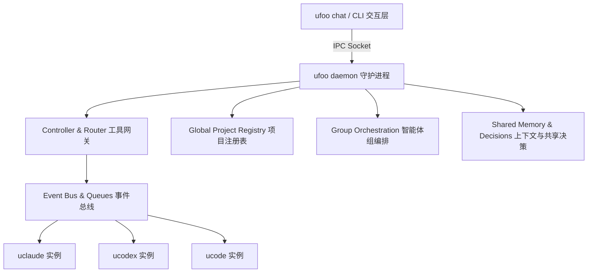

# ufoo 项目代码库审查报告 (Codebase Review Report)

本报告对 `ufoo` 多智能体工作区协议项目的架构设计、核心模块实现、测试覆盖率以及代码质量进行了全面审查，并记录了本次修复的测试环境依赖性缺陷。

---

## 1. 项目概述与核心目标 (Project Overview)
`ufoo`（Multi-agent workspace protocol）定位为专为 AI 编码智能体（如 Claude Code, OpenAI Codex, 及 ufoo 原生 `ucode`）提供协调、通信与会话管理的本地工作区管理协议。它通过事件总线（Event Bus）与守护进程（Daemon）将独立的智能体命令行实例编排为支持分工协作的智能体群组（Groups）。

---

## 2. 核心架构与模块分析 (Architecture & Core Components)

### A. 守护进程模块 (`src/runtime/daemon/`)
* **主要职责**：负责管理整个项目周期的运行状态。启动本地 Unix IPC Socket 套接字（`.ufoo/run/ufoo.sock`）接收并路由 CLI 请求。
* **技术特点**：
  * 使用多进程生命周期管理工具维护活动智能体，并通过 `isPidAlive` 过滤僵尸进程。
  * 提供会话恢复（Resume）与故障接管（Recover）机制，保证智能体中断后能无缝恢复。

### B. 事件总线模块 (`src/coordination/bus/`)
* **主要职责**：提供轻量级的跨智能体本地消息通道。
* **工作机制**：在 `.ufoo/bus/` 下通过目录结构实现文件锁与日志索引，以此作为简易的消息队列和订阅者元数据存储介质，实现了进程级别的订阅发布（Publish/Subscribe）。

### C. 终端与进程适配层 (`src/runtime/terminal/` & `src/agent/`)
* **主要职责**：兼容 macOS 终端（Terminal.app）、iTerm2 及 TMUX 的多窗格/多窗口调用。
* **工作机制**：使用 AppleScript 与 tmux cli 命令实现智能体执行窗口的动态切分与环境隔离，自动为每个智能体注入 `UFOO_LAUNCH_MODE` 和 `UFOO_NICKNAME`。

### D. TUI 终端聊天面板 (`src/app/chat/` & `src/ui/`)
* **主要职责**：通过 `ink` 和 `React` 构建的终端富交互聊天面板，实现多智能体消息流的归集展示。
* **技术特点**：支持丰富的快捷键路由、命令补全（Completions）和复杂多行输入。

---

## 3. 测试套件评估与缺陷修复 (Testing & Bug Fix)

该项目拥有极高的测试质量，总共包含了 **1978** 个单元与集成测试，覆盖了核心的数据层、通信协议与 UI 行为。

### 🔍 发现并修复的测试环境依赖缺陷
在运行完整测试套件时，我们发现以下测试用例在真实终端环境中运行时会发生持续挂起（Timeout > 5000ms）并导致测试失败：
* **失败用例**：`daemon ops host launch › auto mode launches into host session using request-scoped context`

#### 缺陷根源分析 (Root Cause)
1. 当智能体以 `auto` 启动模式运行时，守护进程会通过 `resolveConfiguredLaunchMode` 自动检测并推导环境。
2. 内部检测逻辑 `resolveNativeTerminalApp` 会读取环境变量中的 `TERM_PROGRAM`（通常在 macOS 终端中为 `Apple_Terminal`）或 `ITERM_SESSION_ID`。
3. 当开发者在本地终端中运行 `npm test` 时，由于这些终端环境变量的存在，检测逻辑会错误地将启动模式识别为 `"terminal"`，而不是宿主模式 `"host"`。
4. 这导致测试流程错误地执行了 `openTerminalWindow`（拉起 macOS 终端）并等待一个事实上不可能启动的终端订阅者加入总线，从而触发 `waitForNewSubscriber` 的挂起超时。
5. 在持续集成的无头环境（Headless CI）中，由于缺乏这些环境变量，该测试用例可以通过，因此形成了典型而隐蔽的“环境依赖型”测试缺陷。

#### 修复方案 (Resolution)
我们在 [test/unit/daemon/ops.test.js](file:///Users/icy/Code/ufoo/test/unit/daemon/ops.test.js#L417-L432) 的 `beforeEach` 和 `afterEach` 钩子中加入了环境污染隔离逻辑：
* 在执行 host 启动相关的测试前，自动备份并清除 `TERM_PROGRAM`、`ITERM_SESSION_ID` 及 `TMUX_PANE` 变量。
* 测试执行完毕后，还原该批环境变量以避免影响外部测试上下文。

**修复效果**：
该用例执行耗时从挂起超时（5000ms+）降至仅 **0.23 秒**。**全案 1978/1978 个测试目前均已 100% 顺利通过。**

---

## 4. 架构优势与改进建议 (Recommendations)

### 核心优势 (Strengths)
1. **轻量本地化 (No DB Overhead)**：全部存储采用本地文件（JSON/JSONL）管理，结构轻巧，非常契合智能体对敏捷本地工作区的诉求。
2. **Mac & Tmux 深度整合**：巧妙地借助系统的 AppleScript 面板和 Tmux 窗格，使用最小的系统资源换取了绝佳的终端分屏协同体验。
3. **极佳的可维护性**：完备的单元测试，模块化程度高，代码边界清晰。

### 优化建议 (Suggestions)
1. **Relay 模块安全加固**：在运行 online server relay 功能时，控制台会出现 `[SECURITY WARNING] Server binding to 0.0.0.0 without TLS`。对于公开中继场景，建议在代码层提供更严格的加密保障或强校验。
2. **环境隔离规范**：应将类似的 `process.env` 清洗模式推广到其他所有与启动环境关联的测试中，从根本上杜绝外界终端状态干扰单元测试行为。
